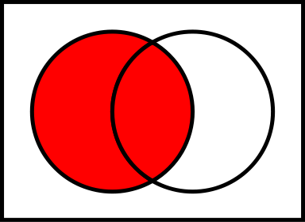
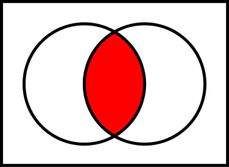

# 3.1\* A Second Take on Logic Operations

As we have seen already in this chapter, the defining characteristic of a modern computer program is its capability of carrying out executions through a complex logical network. At its core are the basic building blocks like flow control, logical operators, conditional loops, iteration, etc. 

In this section, we will look more in depth into the study of logics, a fundamental branch of computer science, the main reason why computers can become smarter and smarter. 

### More on Logical Operators \(or Logical Connectives\)

Let's try to think outside the program a bit. Logical operators are used widely in daily life, not just in programming; they help connect our thoughts together in a meaningful way. Without these logical operators, languages will mean nothing more than a blob of different definitions lumped chaotically together. 

For example, in an English sentence below, the `and` operator we know helps solidify the idea that the person not only likes apples, but also bananas as well. 

```text
I like apples and bananas.
```

If we change the `and` operator to `or`, the meaning of the sentence changes immediately. No longer is the person like both fruits, but he/she will only probably like one of them. Consider the sentence:

```text
I like apples or bananas.
```

Does it sound like the person likes one of the fruits or both?

> In logic, a **logical connective** \(or a **logical operator**\) is a symbol or word used to connect two or more sentences \(of either a programming or natural language\) in a grammatically valid way, such that the value of the compound sentence produced depends only on that of the original sentences and on the meaning of the connective. --From Wikipedia

### A More Mathematical Look at Logical Operators

As we have seen, logical operators help chain different conditions together in various ways that help control the flow of the program. More rigorously, we can group the logical operators we have learned so far in the textbook into the following categories:

1. **Conjunction**: meaning that conditions are joined together as one 
2. **Disjunction**: meaning that conditions are separated apart \(any one of them\)
3. **Negation**: meaning that the conditions are reversed in their meanings
4. **Implication**: meaning that there is a direction of logic from one condition to another 

As we can see quickly, 

* Conjunction is associated with the `and, &&` operators. 
* Disjunction is associated with the `or, ||` operators.
* Negation is associated with the `not, !` operators.
* Implication is associated with the `if` conditional statements \(technically operators as well\)

These operations help group multiple statements together into one compound statement. However, besides chaining statements, these terminologies are also widely and equivalently used in set theory, another branch of math and computer science that studies different collections of things and their relationships with each other. 

As you probably have learned in high school, we can visualize different set relationships using Venn Diagrams. Now, you will see that these **Venn Diagrams can also equivalently represent the decision a program has to make when dealing with logical operations.**

Suppose we have 2 different sets of numbers, abbreviated as $$P$$ and $$Q$$ respectively. We can also equivalently use them to represent 2 different conditions in our program. 

Here's an illustration of what they would stand for equivalently using Venn Diagrams.







As we can see above, the red region stands for essentially what we need to achieve in our programs in order for the inner code blocks to execute. For example, the Conjunction diagram can be interpreted as only when the program reaches a **common** value that can make both conditions $$P$$ and $$Q$$ true, will the inner codes be run. 

### Mathematical Notations for Logical Operators

Before we move onto the next subsection to learn about equivalent logical operations and ways to do that, let's simplify the logical operators in our Ruby programs to their mathematical counterparts \(notation wise\).

| Logical Operators in Ruby | Equivalent Mathematical Operators |
| :--- | :--- |
| `and, &&` | $$\wedge$$ \(Conjunction\) |
| `or, ||` | $$\vee$$ \(Disjunction\) |
| `not, !` | $$\neg$$ \(Negation\) |
| `if P ... <Q>` | $$ P \longrightarrow Q$$ \(Implication\) |


